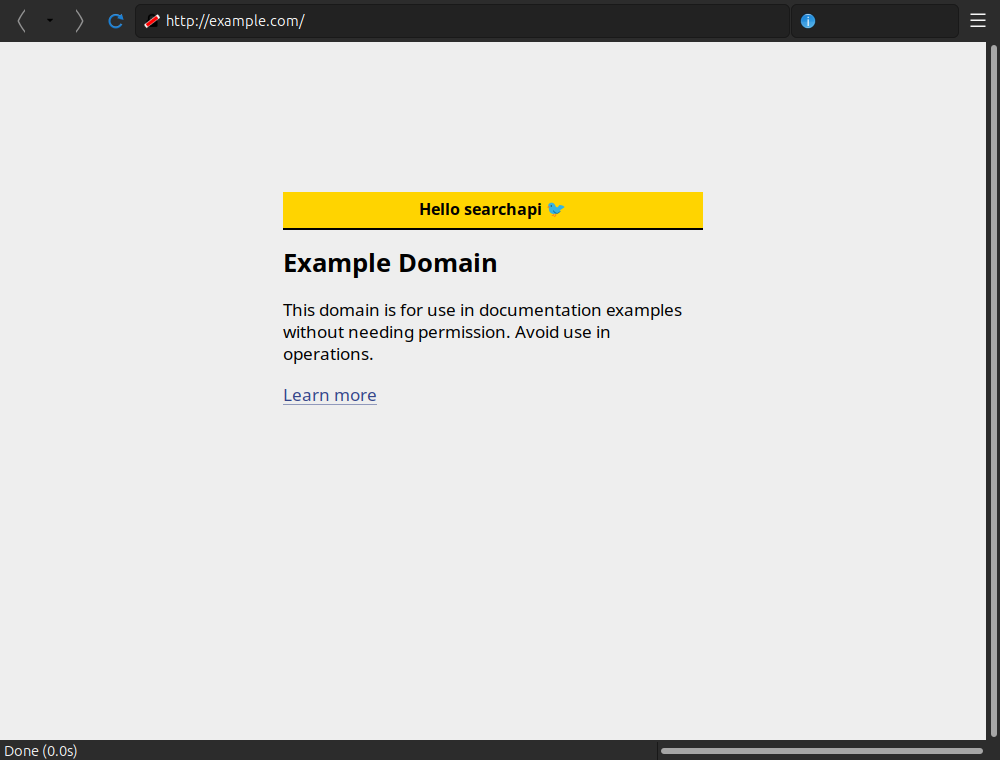
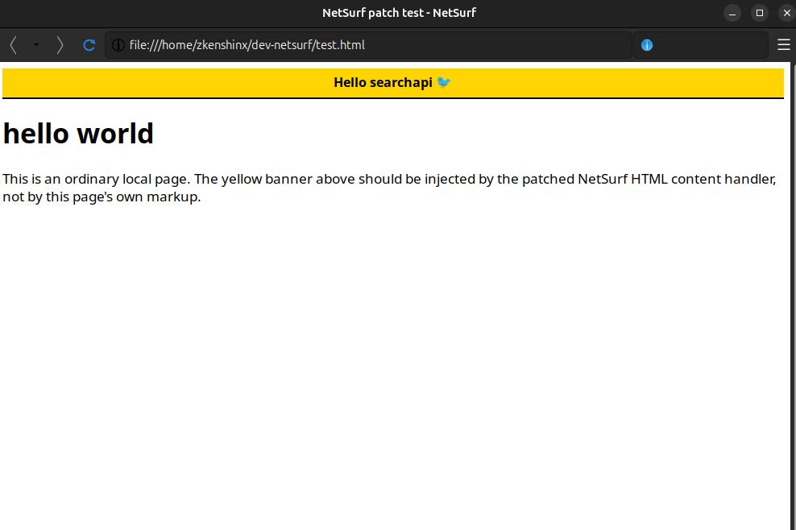

# NetSurf "Hello searchapi" engine patch

**What I changed:** Patched NetSurf's HTML content handler
(`html_finish_conversion` in `content/handlers/html/html.c`) to inject a
"Hello searchapi" banner into the DOM of every page it parses
demonstration of modifying a real browser engine's parse → render pipeline.

## How it works

[NetSurf](https://www.netsurf-browser.org/) is a from-scratch browser engine
with its own HTML parser (`hubbub`), CSS engine (`libcss`) and DOM (`libdom`).

The new `html_insert_searchapi_banner()` runs in `html_finish_conversion()`,
right after the document finishes parsing but **before** the DOM is converted to
a box tree — so the engine lays out and paints the banner exactly like author
content. It reuses NetSurf's own libdom node-building pattern (the same one
`html_exec()` uses): `dom_html_document_get_body`, `dom_document_create_element`,
`dom_document_create_text_node`, `dom_element_set_attribute` and
`dom_node_insert_before`, creating a styled `<div>` and inserting it as the first
child of `<body>`. Any failure is logged and ignored so page load is never broken.

At runtime the engine logs, on every page:

```
[INFO netsurf] content/handlers/html/html.c html_insert_searchapi_banner: searchapi banner: injected into page
```

## The patch

See [`hello-searchapi.patch`](hello-searchapi.patch) — 126 insertions in a single
file, against upstream NetSurf commit `a471a0d44`.

Apply it to a NetSurf checkout with:

```sh
git apply hello-searchapi.patch
```

## Result

The banner is injected by the **engine**, not by the page's markup — it appears
on arbitrary pages, both a local file and a live site:

**Live — example.com:**



**Local test file:**



## Build & run (NetSurf GTK3 on Ubuntu)

```sh
# 1. dev packages
sudo apt-get install --no-install-recommends -y \
    build-essential pkg-config git gperf libcurl4-openssl-dev libexpat1-dev \
    libpng-dev libjpeg-dev libutf8proc-dev libssl-dev flex bison \
    libhtml-parser-perl libgtk-3-dev librsvg2-dev

# 2. NetSurf's own quick-start env
mkdir -p ~/dev-netsurf && cd ~/dev-netsurf
wget https://raw.githubusercontent.com/netsurf-browser/netsurf/master/docs/env.sh
unset HOST && export TARGET_TOOLKIT=gtk3 && source ./env.sh

# 3. clone + build all engine libraries, then the browser
ns-clone
ns-pull-install
cd "$TARGET_WORKSPACE/netsurf"
git apply /path/to/hello-searchapi.patch
make TARGET=gtk3

# 4. run
./nsgtk3 http://example.com
```
